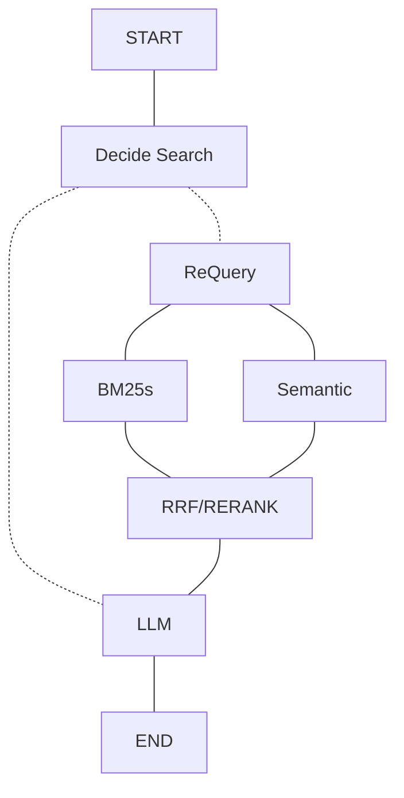

# FastRag
Fast Rag

```mermaid
flowchart TB
    n1["START"] --- n2["Decide Search"]
    n2 -.- n3["LLM"] & n8["ReQuery"]
    n4["BM25s"] --- n6["RRF/RERANK"]
    n5["Semantic"] --- n6
    n6 --- n3
    n3 --- n7["END"]
    n8 --- n5 & n4
```
